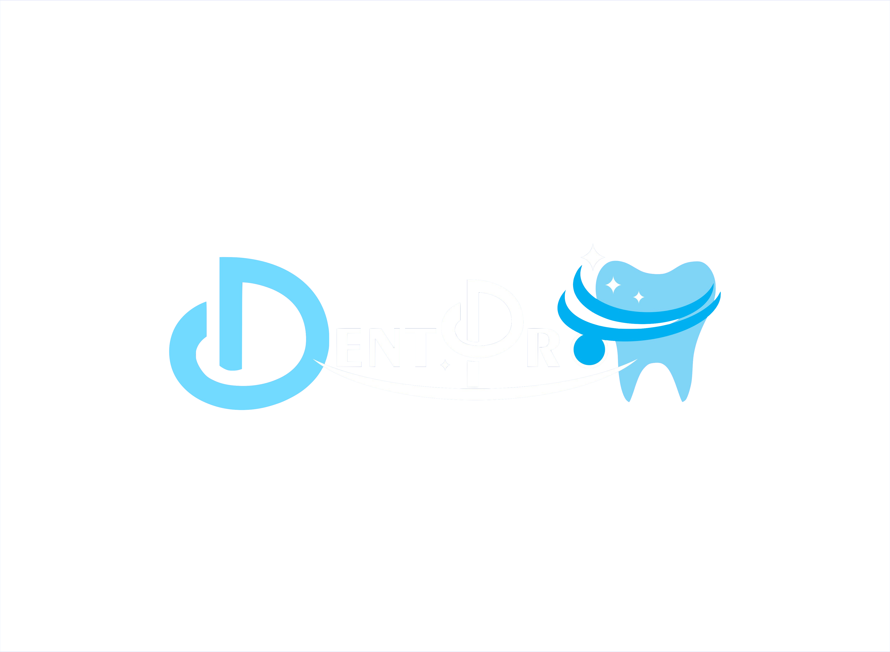

# DentPro Colombia — Design System

This is a brand & UI system distilled from the [DentPro Colombia codebase](https://github.com/Alejorodr/DentPro-Colombia) — a Next.js App Router platform for a specialized dental clinic in **Chía, Cundinamarca, Colombia**. The product blends a Spanish-language marketing site (lead capture + booking + Google reviews) with a multi-role clinical portal (patient, professional, receptionist, administrator).

The system is in Spanish. Tone is warm and clinically precise — see `CONTENT FUNDAMENTALS` below.

> **Sources used**
> - GitHub repo: **https://github.com/Alejorodr/DentPro-Colombia** (mounted as `DentPro-Colombia/` in this project; readers can explore the same repo to extend this system)
> - Logo files & storefront photo provided by the brand owner (now in `assets/`)
> - Tailwind v4 + Phosphor Icons stack — design tokens come from `app/globals.css` + `tailwind.config.js`
>
> If you want to build a richer system, the repo's `app/(marketing)/components/` and `app/portal/components/` folders contain the source-of-truth React for every screen.

---

## Index

| Path | What's inside |
|---|---|
| `README.md` | This file — brand context, content rules, visual foundations, iconography |
| `SKILL.md` | Agent Skills front-matter to invoke this system from Claude Code |
| `colors_and_type.css` | All design tokens — colors, fonts, shadows, gradients, radii, spacing, semantic type roles. Drop-in for any HTML/JSX. |
| `assets/` | Brand logos (color, light-blue, navy variants), storefront/team photo, dental icon SVG |
| `preview/` | Cards rendered in the Design System tab — type ramps, palette, components, etc. |
| `ui_kits/marketing/` | Recreation of the **public marketing site** — landing, services, specialists, booking, contact, login modal, floating CTAs. Open `index.html`. |
| `ui_kits/portal/` | Recreation of the **multi-role clinical portal** — switch between Admin / Profesional / Paciente / Recepción from the topbar. Open `index.html`. |
| `ui_kits/_shared/Icons.jsx` | Shared Phosphor icon set used by both kits. |

---

## Product context

**DentPro Colombia** ("DentPro Chía") is a specialized dental clinic at *Cra. 7 #13-180, Chía, Cundinamarca*. Their tagline-equivalent is **"Odontología integral especializada en Ortodoncia"** (general dentistry specialized in orthodontics). The signage in their storefront photo confirms it.

Services offered (from `lib/marketing/homepage-defaults.ts`):
- Limpieza y profilaxis (cleaning)
- Ortodoncia digital (digital orthodontics — invisible aligners, self-ligating brackets)
- Implantes y cirugía (implants, guided surgery)
- Estética dental (veneers, whitening, smile design)
- Endodoncia avanzada (root canal under microscope)
- Odontopediatría (pediatric)

Operating hours: **Lun–Sáb 8:00–19:00 · Domingos y festivos con cita previa**. WhatsApp +57 323 796 8435.

### Two products in one codebase

1. **Public marketing site** (`app/(marketing)/` + `app/page.tsx`) — landing with hero, services, specialists carousel, booking form, contact + Google Maps embed. Spanish, public-facing, lead-capture oriented.
2. **Clinical portal** (`app/portal/`) — four role-specific shells:
   - **PACIENTE** — see upcoming appointments, treatment history, consents, profile
   - **PROFESIONAL** — agenda, patient files, prescriptions, lab results
   - **RECEPCIONISTA** — dashboard, schedule, patient mgmt, billing, staff
   - **ADMINISTRADOR** — KPIs, revenue trends, staff/services/CMS, audit logs

Auth uses NextAuth (Credentials). The portal UI mixes Spanish labels with English section titles (e.g. `Staff Management`, `Audit Logs`) — typical of a Spanish/LATAM B2B SaaS.

---

## CONTENT FUNDAMENTALS

DentPro writes like a **modern Colombian dental clinic** that wants to feel both clinically credible and personally warm. Voice = **familiar but professional**.

### Language
- **Spanish (Colombia)** is primary. `lang="es"`, `locale="es_CO"`.
- The portal slips into **English for navigation labels** — `Dashboard`, `Staff Management`, `Patient Records`, `Audit Logs`, `Billing`, `Settings`. Page bodies stay in Spanish. This is intentional; preserve the split.

### Person
- **Tú-form, never usted.** "Cuidamos tu sonrisa", "Agenda tu valoración", "¿Qué tratamiento te interesa?", "Cuéntanos cómo podemos ayudarte". Singular, direct, second-person. Never "usted".
- The clinic is **"nosotros"** — "Estamos para ayudarte", "Nuestra sede", "Patient Care DentPro".

### Tone & casing
- **Sentence case** for everything. Titles like "Cuidamos tu sonrisa con tecnología y calidez humana" — only first word capitalized, no Title Case.
- **Uppercase + wide tracking** reserved for tiny eyebrow chips: `ODONTOLOGÍA GENERAL Y ESPECIALIZADA EN CHÍA`, `EQUIPO CLÍNICO`, `INDICADORES CLÍNICOS`. These chips are 12px, semibold, tracked.
- **No exclamation marks** in product copy. The form success state is "¡Gracias! Te contactaremos muy pronto." — one ¡! per page, tops.

### Vocabulary patterns
- Combine warmth + clinical detail in the same sentence: *"odontología especializada con agendamiento en línea, atención humana y seguimiento clínico seguro"*.
- Stat blocks read as **claim · proof**: `+2.500 sonrisas` / `atendidas en Cundinamarca` — large number then plainspoken context.
- Service descriptions are **one-line clinical capability + 3 bullet highlights** ("Profilaxis guiada por imagen", "Educación en hábitos de cuidado").
- CTAs are **verbs, tú-form**: `Agenda tu cita`, `Ver disponibilidad`, `Te contactamos`, `Reservar turno`, `Solicitar agenda`, `Iniciar sesión`.

### Numbers, dates, money
- Dates `es-CO`: `Lun–Sáb 8:00-19:00`, `Sáb 14 dic · 9:00 a. m.`
- Currency: `Intl.NumberFormat("es-CO", { style: "currency", currency: "COP" })` — no decimals: `$1.250.000`.
- Phone: `+57 323 796 8435` (e164 in `tel:`, spaced for display).

### No emoji
The codebase contains zero emoji in user copy. Phosphor icons fill that role (see `ICONOGRAPHY`). **Don't add emoji** when generating DentPro content.

### Examples to imitate

> Badge: *Odontología general y especializada en Chía*
> H1: *Cuidamos tu sonrisa con tecnología y calidez humana*
> Lead: *Agenda tu valoración en DentPro Colombia y accede a tratamientos preventivos y especializados sin salir de Chía.*
> Primary CTA: *Ver disponibilidad*  ·  Secondary: *Te contactamos*

> Section title: *Tratamientos personalizados para cada etapa*
> Service card: *Ortodoncia digital — Alineadores invisibles y brackets autoligables según tus objetivos.*
> Highlight bullets: *Escaneo 3D en la primera visita · Planificación con simulación virtual · Controles mensuales personalizados*

> Booking benefit: *Especialistas certificados por asociaciones internacionales*
> Consent note: *Al enviar este formulario autorizas el tratamiento de tus datos según nuestra política de privacidad.*

---

## VISUAL FOUNDATIONS

### Color
- A **dual-hue brand: deep blue + warm gold**, plus slate neutrals. From deepest to lightest blue: `#031536` midnight → `#0a3d91` "brand-teal" (which is actually a deep navy-indigo — its name in code is misleading) → `#1f6cd3` brand-indigo → `#4cc3f1` brand-sky → `#5bd0ff` accent-cyan → `#e6f4ff` brand-light.
- **Gold** (`--color-gold` `#c8901f`, with `--color-gold-bright #e6b450` and `--color-gold-soft #f5d27a`) is a real brand color, pulled from the canonical logo's swoosh. It is the **accent** that signals premium, orthodontic, or campaign-grade moments. The current Next.js codebase doesn't use gold yet — but the brand owner's logo demands it. Use gold for: brand seals, hero swooshes that echo the logo, ortodoncia campaign cards, premium tier markers, anniversary/award badges. **Never** for body text, default CTAs, or generic UI chrome.
- The blue + gold combination is signature when both appear on a **deep blue background** — that's the canonical lockup (see `assets/logo-canonical.png` and the `logo-on-navy.jpg` storefront treatment).
- **No greens, no purples, no other warm accents.** Slate neutrals (`slate-50` → `slate-900`) for fg/bg ramps. Semantic red (`text-red-*`) only for form errors.
- Light theme = **white + slate + brand-light tints** on a pale blue page wash. Dark theme = **`#0f172a` base, `#1e293b` muted, `#111b2d` elevated**, with `--color-accent-cyan` (`#5bd0ff`) replacing brand-teal for any UI accent.

## VISUAL FOUNDATIONS

### Color

### Spacing & layout
- Tailwind defaults. Sections are `py-20` (80px vertical). Containers are `mx-auto px-6` (24px gutters) within a max-width content column.
- Cards pad at `p-6` (24px) up to `p-8`. Card content uses `space-y-*` rather than margins.
- Grids prefer **2 columns on tablet, 3 on desktop**, gap-8 (32px). Hero is **2-column at lg+** with `gap-16`.
- Portal sidebar is fixed-width **288px** (`w-72`) with `md:pl-72` on the main column.

### Backgrounds
- **Hero washes**: subtle multi-radial gradients fading into a vertical light gradient. Defined as `--background-image-hero-light` / `--background-image-hero-dark`. Never a single flat color.
- **Section bodies**: white or `bg-brand-light` (pale blue, `#e6f4ff`) alternating to create rhythm. Specialists section sits on `bg-brand-light`.
- **The "agenda" booking panel**: full brand gradient (`--gradient-brand`) — the only saturated full-bleed surface in the app. White text inside.
- **Dark mode hero**: deep navy radial wash (`#031536` → `#0b1f46`).
- **No repeating patterns, no textures, no grain, no hand-drawn illustrations.** Backgrounds are gradients + white space.

### Imagery
- Editorial-style photography of patients & specialists. Warm, naturally lit, color-graded slightly cool/clinical. Never b&w.
- The clinic exterior shot (`assets/storefront-team.png`) is the canonical "team in scrubs" reference — all blue scrubs on white tile, signage prominent.
- Specialist portraits are framed in a rounded `card` with a gradient panel behind, then a separate review/quote card stacked beneath.

### Borders, shadows, elevation
- **Borders are translucent** (`border-white/70`, `border-brand-indigo/25`, `border-accent-cyan/30`). Solid 1px borders only on inputs and dividers.
- Three signature shadows:
  - `shadow-xl shadow-slate-900/10` — default card lift
  - `--shadow-glow` (`0 28px 70px -25px rgba(10, 61, 145, 0.45)`) — primary buttons + hero highlight card
  - `--shadow-surface-dark` — dark-mode card depth
- **Inner shadows** on icon circles (`shadow-inner shadow-brand-teal/20`) and on the hero gradient tile.

### Corner radii
- Pills (`rounded-full`) for buttons, badges, info-bar tags, navbar avatars, social links, floating actions.
- `rounded-2xl` (16px) for icon containers and form inputs.
- `rounded-3xl` (24px) for cards and sliders.
- `rounded-[1.75rem]` (28px) for the **signature card** (`@utility card` in globals.css). This is the most-used radius — feels like the brand's "card shape".
- `rounded-4xl` (36px) for modal cards.
- Nothing is square. The smallest radius on any UI element is 8px (small chips).

### Animation
- **`transition-all duration-200`** for buttons and inputs. **`duration-300`** for theme/colour transitions. **`duration-500`** for slow card cross-fades.
- Easing defaults to Tailwind's `ease-out`. No custom cubic-beziers.
- **Hover state = lift + glow.** `hover:-translate-y-0.5` (buttons) or `hover:-translate-y-1` (cards) + `hover:shadow-glow`. Color does not change on hover for primary buttons; the shadow swap carries the affordance.
- Carousel track uses `transition-transform duration-500 ease-out will-change-transform`.
- Mobile menu opens with a scale-95 → scale-100 + translate-y-4 → 0 reveal over 300ms.
- **No bounces, no springs, no parallax, no scroll-jacking.** Reduced-motion users get `scroll-behavior: auto` and that's it.

### Hover & press states
- **Buttons**: `hover` = `-translate-y-0.5` + amplified shadow (`shadow-glow`). No color change on primary. Secondary tints background `bg-brand-light/60`.
- **Cards**: `hover:-translate-y-1` + `hover:shadow-2xl`.
- **Nav links**: simple color swap to `text-brand-teal` (light) / `text-accent-cyan` (dark).
- **Press / active**: no explicit `active:` state styles in the codebase. Disabled = `opacity-60` + `pointer-events-none`.
- **Focus**: visible 2px ring, `ring-brand-indigo/70` (light) or `ring-accent-cyan/60` (dark), with offset. Always paired with `focus-visible:outline-hidden`.

### Transparency & blur
- Top nav and info bar use `bg-white/80 backdrop-blur-lg` over a colored body — semi-translucent **frosted-glass topbar**.
- Modals use `bg-slate-900/70 backdrop-blur-lg` for the scrim.
- Mobile menu, login modal, floating cards over hero — all use translucency + blur.
- Solid surfaces only on the brand-gradient booking panel and on dense data surfaces (admin tables).

### Layout rules — fixed elements
- `<header class="topbar">` sticks to top, z-40.
- **Floating WhatsApp + phone buttons** anchored `fixed bottom-6 right-6` (z-40), 56px circles, brand-teal fill, lift on hover. Two of them stack vertically.
- Portal sidebar is `fixed inset-y-0 left-0 w-72` on desktop, slide-in drawer on mobile.

### Cards — the signature pattern
Every card in DentPro looks like:
```
relative overflow-hidden rounded-[1.75rem]
border border-white/70
bg-white/90
p-6
shadow-xl shadow-slate-900/10
transition-all duration-300
hover:-translate-y-1 hover:shadow-2xl
dark: border-surface-muted/60 bg-surface-base/85 shadow-surface-dark
```
A 28px-radius rectangle, translucent white fill, soft border, large diffused shadow. On hover it lifts 4px. In dark mode the fill goes to a translucent dark-navy.

---

## ICONOGRAPHY

### System
**[Phosphor Icons](https://phosphoricons.com/)** via `@phosphor-icons/react`. Always referenced through the project's barrel at `components/ui/Icon.tsx` — never imported directly.

```tsx
import { CalendarCheck, Tooth, WhatsappLogo } from "@/components/ui/Icon";
```

Available out-of-the-box (the icons actually used in the product):
`ArrowLeft, ArrowRight, Baby, Bell, CalendarBlank, CalendarCheck, CaretLeft, CaretRight, ChartLineUp, ChatCircleDots, CheckCircle, CircleNotch, ClipboardText, Clock, ClockCounterClockwise, Copyright, CreditCard, DiamondsFour, EnvelopeSimple, Eye, FacebookLogo, FileArrowUp, FileText, Flask, Funnel, Gear, Headset, House, InstagramLogo, LinkedinLogo, List, Lock, MagnifyingGlass, MapPin, Medal, Microphone, Moon, MoonStars, PencilSimple, Phone, Printer, Question, ShieldCheck, ShieldWarning, SignIn, SignOut, Smiley, Sparkle, SquaresFour, Stethoscope, Sun, TiktokLogo, Tooth, TrendUp, Trash, UserCheck, UserCircle, UserMinus, Users, UsersFour, UsersThree, WarningCircle, WhatsappLogo, X, XCircle`.

### Weights
DentPro uses Phosphor's `weight` variants — never the default thin.
- `weight="bold"` — most UI: buttons, nav, services
- `weight="fill"` — small status icons inside the InfoBar (location pin, clock, WhatsApp), checklist checkmarks
- Plain (no weight) — never used in product

### Sizes
- 16px (`h-4 w-4`) — inline with text
- 20px (`h-5 w-5`) — buttons, nav items
- 24px (`h-6 w-6`) — services / floating actions
- Wrapped in **icon containers** at 40px (`icon-badge`) or 56px (`icon-circle`) — soft brand-light fill, brand-teal stroke, inner-shadow, rounded-2xl. See `app/globals.css → @utility icon-badge / icon-circle`.

### Conventions
- **One service = one icon.** Mapping lives in `app/(marketing)/components/icon-registry.tsx`. Adding a service means registering its icon there.
- **No emoji.** No unicode picto chars. No PNG icons. Phosphor only.
- The **dental SVG glyph** at `app/icon.svg` (copied to `assets/icon.svg`) is the favicon — a tiny tooth used in browser tabs and PWA manifest.
- Logos are PNGs/JPGs (copied from brand owner). No simplified mark — when space is tight, use the "DP" monogram (white text on `bg-brand-teal` circle) that the navbar already uses.

### CDN fallback
If consuming this design system outside Next.js (e.g. in a static HTML mock), Phosphor ships a single ES module + CSS pair you can link directly. Otherwise the project's `Icon.tsx` barrel is the canonical way.

### Logo asset inventory (`assets/`)
| File | Use |
|---|---|
| `logo-primary.png` | Full color (navy + gold + sky-blue tooth) on white. **Print and master mark.** Has gold accents that don't appear in the website UI. |
| `logo-full-color.png` | Same lockup but with sky-blue swoosh instead of gold. Web-ready. |
| `logo-light-blue.png` | All-light-blue monotone. Use on white backgrounds when full color is too heavy. |
| `logo-on-navy.jpg` | The brand version with navy background and white/blue swoosh — the storefront sign treatment. |
| `storefront-team.png` | Photo: team in blue scrubs in front of the Chía storefront. Use as the "about us" / hero photo when generic stock won't do. |
| `logo-master.pdf` | Vector master from the brand owner. |
| `icon.svg` | Favicon glyph (small tooth). |

---

## Getting started in a generated artifact

```html
<link rel="stylesheet" href="colors_and_type.css">
<style>
  body { background: var(--gradient-hero-light); color: var(--fg-1); }
</style>

<header style="
  background: rgba(255,255,255,0.8);
  backdrop-filter: blur(20px);
  border-bottom: 1px solid var(--border-1);
">
  
</header>

<button class="dp-btn-primary">Agenda tu cita</button>
```

For the full vocabulary of `dp-btn-primary` / `dp-card` / `dp-input`, see the rendered cards in `preview/` or copy from the UI kits.
